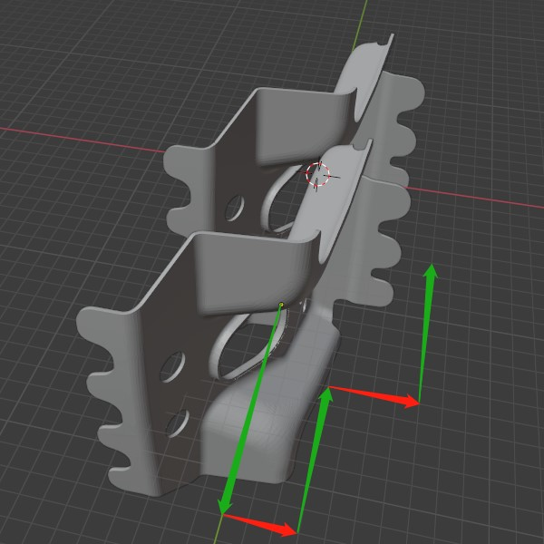
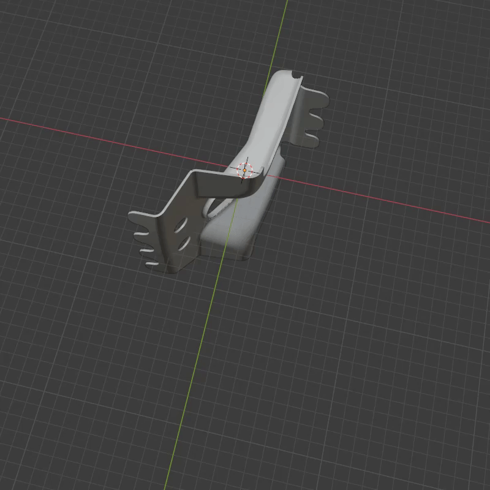
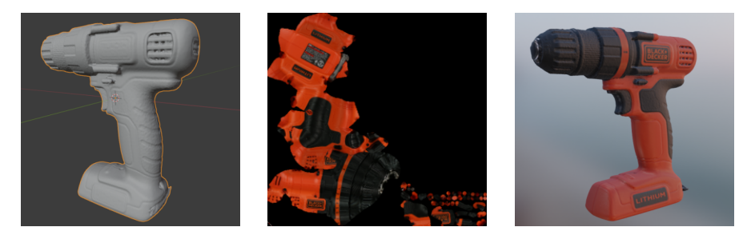

# Virtual Dataset via Blender 

---

## Installation 

`<root>` is Blender installation path.  

### 1. Download Add-ons 
- [Blender-Molecular-Script](https://github.com/kissablemt/Blender-Molecular-Script) 

- [blainder-range-scanner](https://github.com/kissablemt/blainder-range-scanner) 

- [bpycv](https://github.com/kissablemt/bpycv) 

### 2. Copy to `addons`  

***After the add-ons modification and testing, it is recommended to copy the add-ons to `<root>/2.83/scripts/addons_contrib/`, which will no longer need `sys.path.append("<addons path>")`*** 

- Copy `Blender-Molecular-Script/molecular` to `addons/molecular` 

- Copy `blainder-range-scanner/range_scanner` to `addons/range_scanner` 

- Copy `bpycv/bpycv` to `addons/bpycv` 


### 3. Install Requirements 

- **Windows**: Use `<root>\2.83\python\Scripts\pip.exe` to install `requirements.txt`. 

- **Linux**: Use `<root>/2.83/python/bin/python3.7m` to install `requirements.txt`.  

*WARNING*:  make sure you are using Blender's Python to install requirements.

<br />

## Add-ons Usage 

*WARNING*:  make sure you add `addons` to `sys.path` or copy the add-ons to `<root>/2.83/scripts/addons_contrib/`.
> ```python 
> import sys
> sys.path.append("<addons path>")
> from addons import molecular
> from addons import range_scanner
> from addons import bpycv
> ``` 

- ### molecular 
The detail is here 👉 [kissablemt/Blender-Molecular-Script](https://github.com/kissablemt/Blender-Molecular-Script/blob/master/README.md) 

*Run `python make_release.py` first*

- ### range_scanner 
The detail is here 👉 [kissablemt/blainder-range-scanner](https://github.com/kissablemt/blainder-range-scanner/blob/main/README.md) 

- ### bpycv 
The detail is here 👉 [kissablemt/bpycv](https://github.com/kissablemt/bpycv/blob/master/README.md) 


<br /><br />  

---

## Usage 

### 1. Base Settings 
1. Change `sys.path` in `scripts/main.py`.
2. Change `root_dir` in `configs/base.py`.

### 2. Build Scene
`scripts/build_scene.py` contains the construction of the scene. 

- **Camera**: `create_camera()` 

    1. Change `location` and `rotation_euler`. 
    2. `utils.blender.look_at(camera, point)` can make the lens point towards the target point easily. 
    3. Some camera rendering settings will change after the function `scripts.generate_dataset.kinect_v1()` is called, but not including `location` and `rotation_euler`.

    *WARNING*:  *DO NOT* change the name of the camera, which will cause error in `scripts.generate_dataset.kinect_v1()`

    <br />


- **Light**: `create_light()`

    Modify the light type and intensity as required.

    <br /> 

- **Target**: `create_target()`
    It Is just creating template target for particle system generation, `location` and `rotation_euler` are not important.

    1. Change `scale`. 
    2. Change material settings. 

    <br />

- **Contatiner**: `create_container()`
    Used to collide with particles.

    1. Change `location`， `rotation_euler` and `scale`. 
    2. Change material settings. 

    <br />

- **Emitter**: `create_emitter()`
    Parameter settings need to view [Blender-Molecular-Script](https://github.com/kissablemt/Blender-Molecular-Script) source code or view it in the GUI interface.


<br /><br /> 

### 3. Generate Dataset
`scripts/generate_dataset.py` contains the depth camera simulation and rendering. 

- [blainder-range-scanner](https://github.com/kissablemt/blainder-range-scanner) 

- [bpycv](https://github.com/kissablemt/bpycv) 

<br /><br /> 

### 4. Convert Segmentation Images to COCO Annotation 
- [seg2coco](https://github.com/kissablemt/seg2coco) 

<br /><br /> 

---

## Extra 

### `scripts/arrange_sequently.py`  
Place two objects close enough.  

Reference from [check intersection](https://blender.stackexchange.com/questions/9073/how-to-check-if-two-meshes-intersect-in-python) 

 

 

### `scripts/surround.py`  


---

## Result

- videos:
  - https://github.com/kissablemt/virtual-dataset/blob/main/docs/videos/blainder.mp4
  - https://github.com/kissablemt/virtual-dataset/blob/main/docs/videos/material.mp4
  - https://github.com/kissablemt/virtual-dataset/blob/main/docs/videos/mole.mp4
  - https://github.com/kissablemt/virtual-dataset/blob/main/docs/videos/point_cloud.mp4

- UV


